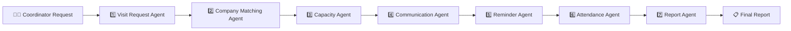
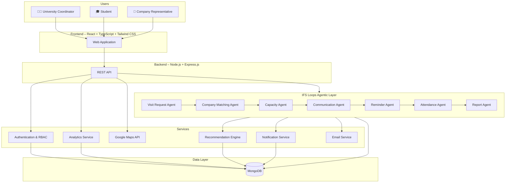
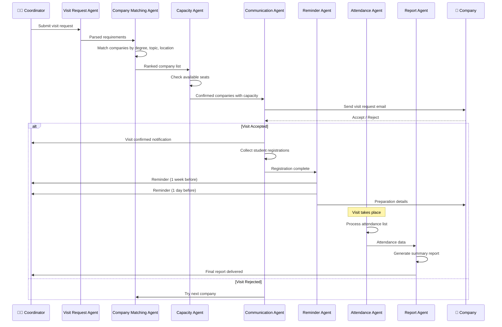
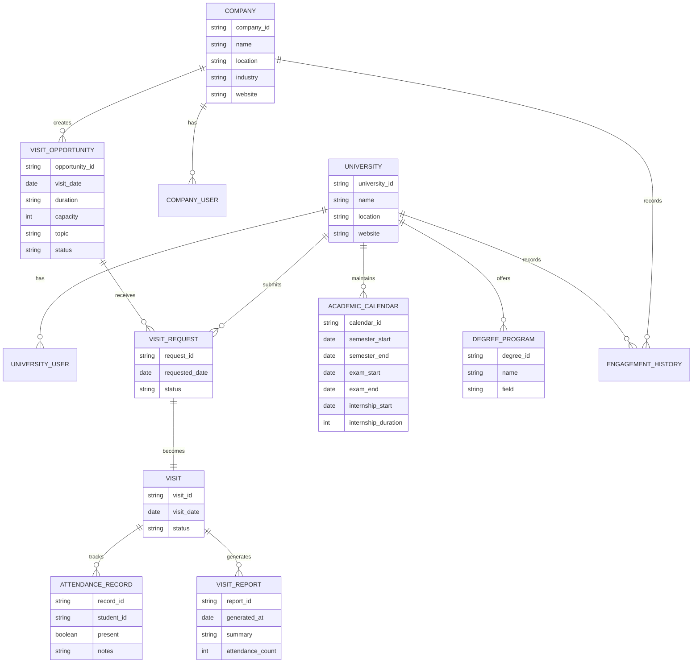

# INDUSTRYxLINK – Industry–Academia Engagement Platform

> A centralised platform connecting universities and companies to discover, coordinate, manage, and analyse industry visits and academic–industry engagement opportunities.

---

## 📌 Overview

**INDUSTRYxLINK** is an agentic application that automates the end-to-end process of organising university industry visits.

Rather than relying on manual emails, phone calls, spreadsheets, and fragmented communication channels, INDUSTRYxLINK deploys **multiple collaborating AI agents** — built on the **IFS Loops** agentic framework — that work together to discover suitable companies, manage student registrations, check capacity, coordinate communication, send reminders, process attendance, and generate reports.

This is not a chatbot. It is an **enterprise workflow automation system** where multiple agents make decisions based on information and business rules, demonstrating the power of **agentic AI** applied to a real-world coordination problem.

---

## 🎯 Problem

University industry visits provide students with valuable exposure to real-world software engineering, technology, business, and professional environments. However, the current process is entirely manual:

- **Communication overhead** – Coordinators need to email and call companies individually.
- **Student registration** – Collecting and managing registrations via forms and spreadsheets.
- **Capacity management** – Manually checking how many seats are available and managing quotas.
- **Attendance tracking** – Processing attendance lists after each event by hand.
- **Reminders** – Sending timely reminders to both students and companies before visits.
- **Reporting** – Creating summary reports manually after each visit.
- **Discovery** – Universities struggle to find suitable companies based on degree programmes, student count, and subject areas.
- **Calendar conflicts** – Academic calendars, examination periods, and internship periods are not considered systematically.
- **Disruption handling** – Visit postponements and cancellations cause transportation and scheduling problems with no automated notification.

---

## 💡 Proposed Solution – Multi-Agent Architecture

INDUSTRYxLINK solves this by deploying **seven specialised AI agents** that collaborate through the IFS Loops framework:

### 🤖 The Seven Agents

| # | Agent | Responsibility |
|---|-------|---------------|
| 1 | **Visit Request Agent** | Receives and processes a visit request from a university coordinator |
| 2 | **Company Matching Agent** | Identifies suitable companies based on the students' degree/subjects and requested visit area |
| 3 | **Capacity Agent** | Checks the number of available seats and manages the student quota |
| 4 | **Communication Agent** | Generates and sends emails to companies and students |
| 5 | **Reminder Agent** | Sends timely reminders before the visit |
| 6 | **Attendance Agent** | Processes the attendance list after the event |
| 7 | **Report Agent** | Generates a summary report for the coordinator |

### 🔄 How the Agents Collaborate



Each agent is autonomous but communicates with others to form a **coordinated workflow pipeline**.

---

## 🚀 Example Workflow

> **Coordinator:** *"We need an industry visit for 40 second-year Software Engineering students interested in cloud computing during October."*

Here's how the agents respond:

```
1. Visit Request Agent
   └─ Parses the request → 40 students, 2nd year, Software Engineering, Cloud Computing, October

2. Company Matching Agent
   └─ Identifies suitable companies offering Cloud Computing sessions
   └─ Matches by: degree relevance, visit topics, location, previous engagement
   └─ Returns ranked list: Company A (95%), Company B (87%), Company C (72%)

3. Capacity Agent
   └─ Checks available seats at each matched company
   └─ Company A: 50 seats available ✅
   └─ Company B: 30 seats available ❌ (insufficient for 40)
   └─ Company C: 45 seats available ✅

4. Communication Agent
   └─ Generates and sends formal visit request emails to Company A & C
   └─ Sends confirmation requests to students
   └─ Collects student registrations

5. Reminder Agent
   └─ Schedules reminders: 1 week before, 3 days before, 1 day before
   └─ Sends reminders to registered students
   └─ Sends preparation details to the company

6. Attendance Agent
   └─ Processes the attendance list after the visit
   └─ Marks present/absent students
   └─ Flags no-shows

7. Report Agent
   └─ Generates a comprehensive summary report
   └─ Includes: attendance statistics, company feedback, student participation
   └─ Delivers report to the coordinator
```

---

## 🧠 Why Agentic AI?

This project goes beyond a simple chatbot or CRUD application:

| Aspect | Traditional Approach | INDUSTRYxLINK Agentic Approach |
|--------|---------------------|-------------------------------|
| Discovery | Manual search, emails, phone calls | Company Matching Agent auto-identifies suitable companies |
| Capacity | Spreadsheets, back-and-forth emails | Capacity Agent checks and manages quotas in real-time |
| Communication | Individual emails composed manually | Communication Agent generates and sends emails automatically |
| Reminders | Coordinator remembers to send reminders | Reminder Agent sends scheduled notifications automatically |
| Attendance | Paper lists, manual entry | Attendance Agent processes and flags discrepancies |
| Reporting | Manual report creation | Report Agent generates comprehensive summaries |
| Decision-making | Human-driven, sequential | Multiple agents collaborate and make decisions based on business rules |

---

## 🏗️ System Architecture



---

## 🔄 Visit Management Workflow



---

## 🧩 Agent Details

### 1. Visit Request Agent

- Receives natural language requests from university coordinators
- Extracts key parameters: student count, year, degree programme, topic interests, preferred dates
- Validates the request against university academic calendar
- Passes structured requirements to the Company Matching Agent

### 2. Company Matching Agent

- Maintains a knowledge base of registered companies and their visit offerings
- Matches based on: degree relevance, visit topics, company industry, location, previous engagement history
- Calculates a **suitability score** for each company:

```text
Suitability Score =
    Degree Match
    + Visit Topic Match
    + Capacity Match
    + Date Compatibility
    + Internship Period Compatibility
    + Location Proximity
    + Previous Engagement Score
```

- Returns a ranked list of suitable companies

### 3. Capacity Agent

- Checks real-time availability at each matched company
- Verifies: maximum participant capacity, available time slots, existing bookings
- Filters out companies that cannot accommodate the requested student count
- Manages quota allocation when multiple universities request the same company

### 4. Communication Agent

- Generates professional visit request emails to companies
- Sends confirmation and registration links to students
- Handles acceptance/rejection responses from companies
- Manages follow-up communication for pending requests

### 5. Reminder Agent

- Schedules automated reminders at configurable intervals
- Sends reminders to: students (registration deadlines, visit details), companies (preparation requirements), coordinators (action items)
- Handles visit postponement and cancellation notifications
- Triggers re-scheduling workflows when needed

### 6. Attendance Agent

- Processes attendance data after the visit
- Compares registered students against actual attendees
- Flags no-shows and late cancellations
- Records attendance statistics for analytics

### 7. Report Agent

- Generates comprehensive post-visit summary reports
- Includes: attendance statistics, company feedback, student participation rates, visit outcomes
- Provides historical trend analysis
- Delivers formatted reports to the coordinator

---

## 🎯 Core Features

### Industry Opportunity Discovery
Universities discover companies and available visit opportunities automatically through the Company Matching Agent.

### Smart Recommendation System
A recommendation engine suggests suitable companies and visit opportunities based on multiple weighted factors.

### Visit Quota Management
Companies define maximum participants, available slots, and eligible degree programmes. The Capacity Agent manages this in real-time.

### Academic Calendar Integration
Universities maintain semester dates, examination periods, internship periods, and holidays. Agents use this data when identifying suitable visit dates.

### Automated Communication
The Communication Agent handles all emails — from initial requests to confirmations and follow-ups.

### Intelligent Reminders
The Reminder Agent ensures timely notifications to all parties at configurable intervals.

### Attendance Processing
The Attendance Agent automates post-visit attendance tracking and discrepancy detection.

### Automated Reporting
The Report Agent generates comprehensive summaries — no manual report creation needed.

### Engagement Analytics
Dashboards for universities and companies showing historical trends, engagement patterns, and participation statistics.

### Location & Distance
Google Maps integration displays company locations, distances, and estimated travel times.

---

## 🧑‍💻 User Roles

| Role | Responsibilities |
|------|-----------------|
| University Coordinator | Submit visit requests, manage university profile, view reports |
| Lecturer | Discover opportunities, coordinate visits |
| Student | View available visits, register, receive notifications |
| Company Coordinator | Manage visit opportunities, accept/reject requests |
| System Administrator | Manage platform, users, and agent configurations |

---

## 🛠️ Technology Stack

### Frontend
- React.js
- TypeScript
- Tailwind CSS
- Vite
- Axios
- React Router
- Recharts

### Backend
- Node.js
- Express.js
- TypeScript
- REST API
- Mongoose

### Agentic Framework
- **IFS Loops** – Multi-agent orchestration and collaboration

### Database
- MongoDB

### Authentication
- JWT
- Role-Based Access Control (RBAC)
- bcrypt

### External Services
- Google Maps API
- Google Maps Distance Matrix / Routes API
- Email Notification Service (SMTP / SendGrid)

### DevOps & Development
- Git
- GitHub
- GitHub Actions
- Docker
- Docker Compose

---

## 📁 Project Structure

```text
INDUSTRYxLINK/
│
├── frontend/
│   ├── src/
│   │   ├── components/
│   │   ├── pages/
│   │   ├── layouts/
│   │   ├── services/
│   │   ├── hooks/
│   │   ├── utils/
│   │   └── types/
│   │
│   ├── public/
│   ├── package.json
│   └── vite.config.ts
│
├── backend/
│   ├── src/
│   │   ├── controllers/
│   │   ├── services/
│   │   ├── routes/
│   │   ├── models/
│   │   ├── middleware/
│   │   ├── agents/              ← IFS Loops Agent definitions
│   │   │   ├── visitRequestAgent.ts
│   │   │   ├── companyMatchingAgent.ts
│   │   │   ├── capacityAgent.ts
│   │   │   ├── communicationAgent.ts
│   │   │   ├── reminderAgent.ts
│   │   │   ├── attendanceAgent.ts
│   │   │   └── reportAgent.ts
│   │   ├── validators/
│   │   ├── utils/
│   │   ├── config/
│   │   └── types/
│   │
│   ├── tests/
│   └── package.json
│
├── docs/
│   ├── architecture/
│   ├── api/
│   ├── database/
│   └── requirements/
│
├── docker-compose.yml
├── .gitignore
└── README.md
```

---

## 🗄️ High-Level Database Model



---

## 📊 Analytics Dashboard

### University Dashboard

```text
Total Visits          12
Completed Visits       9
Upcoming Visits        2
Cancelled Visits       1

Companies Engaged     8
Students Participated 430
Agent Actions Today    27
```

### Company Dashboard

```text
Universities Hosted   15
Total Visits          28
Students Reached      1,250

Top Degree:
Software Engineering

Most Active Period:
June – August

Automated Emails Sent: 342
```

---

## 🔐 Security

- JWT-based authentication
- Role-based access control
- Password encryption with bcrypt
- API authorization
- Input validation
- Secure API communication
- Protection against unauthorized access
- Audit logging for all agent actions

---

## 🔮 Future Enhancements

- **Advanced NLP** – More natural language understanding in Visit Request Agent
- **Machine Learning** – ML-enhanced Company Matching Agent using historical data
- **Multi-channel Communication** – WhatsApp, SMS, and push notifications via Communication Agent
- **Feedback Agent** – A new agent that collects and analyses student/company feedback post-visit
- **Scheduling Agent** – Intelligent date negotiation between universities and companies
- **Internship Matching** – Extending agents to recommend internship placements
- **Research Collaboration** – Agent-managed university–company research partnerships
- **National Analytics** – Country-level university–industry engagement dashboards
- **Calendar Integrations** – Google Calendar, Outlook sync
- **Guest Lecture Management** – Agent-coordinated guest lecture scheduling

---

## 🏆 Why This Is Suitable for the IFS Loops Agentic Workshop

This project directly demonstrates **agentic AI + enterprise workflow automation**, rather than simply building a chatbot:

1. **Multiple Collaborating Agents** – Seven specialised agents work together, each with distinct responsibilities
2. **Decision-Making** – Agents make decisions based on information and business rules (matching, capacity, scheduling)
3. **Real-World Problem** – Solves a genuine coordination challenge faced by universities
4. **Enterprise Workflow** – End-to-end automation from request to report
5. **IFS Loops Integration** – Built on the IFS Loops framework for agent orchestration
6. **Scalable Architecture** – New agents can be added as the system evolves
7. **Observable Pipeline** – Each agent's actions and decisions can be inspected and audited

---

## 🎯 Project Objectives

1. Demonstrate agentic AI applied to enterprise workflow automation.
2. Centralise university–industry visit coordination through collaborating agents.
3. Eliminate manual communication and administrative overhead.
4. Automate company discovery, matching, and capacity management.
5. Automate communication, reminders, and attendance processing.
6. Generate comprehensive reports without human intervention.
7. Provide data-driven insights into industry engagement patterns.
8. Showcase the IFS Loops framework for multi-agent orchestration.

---

## 🌐 Target Users

- Universities, Faculties, and Departments
- Lecturers and Student Coordinators
- University Career/Industry Engagement Units
- Company HR and University Engagement Teams
- Company Technical Teams
- Undergraduate Students

---

## 📌 Project Vision

> **To build an intelligent, agent-driven platform that automates the entire university–industry visit lifecycle — from discovery to reporting — demonstrating how agentic AI can transform enterprise coordination workflows.**

---

## 🤝 Contributing

Contributions are welcome.

1. Fork the repository.
2. Create a feature branch.
3. Commit your changes.
4. Push the branch.
5. Create a Pull Request.

```bash
git clone https://github.com/WijAnushka02/INDUSTRYxlink.git
cd INDUSTRYxLINK
```

---

## 📄 License

This project is developed for educational and research purposes as part of the **IFS Loops Agentic Workshop**.

---

## 👨‍💻 Development Team

**INDUSTRYxLINK**

AI-Powered Agentic University–Industry Visit Management System

Developed as a software engineering project focused on demonstrating agentic AI for university–industry collaboration, built for the **IFS Loops Agentic Workshop**.
