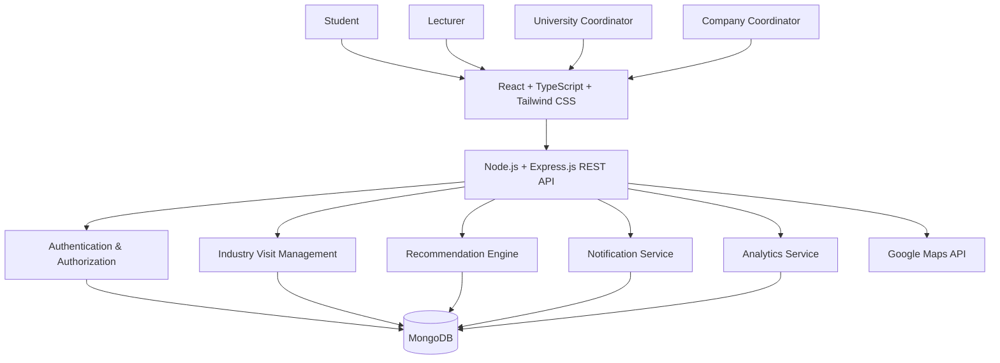
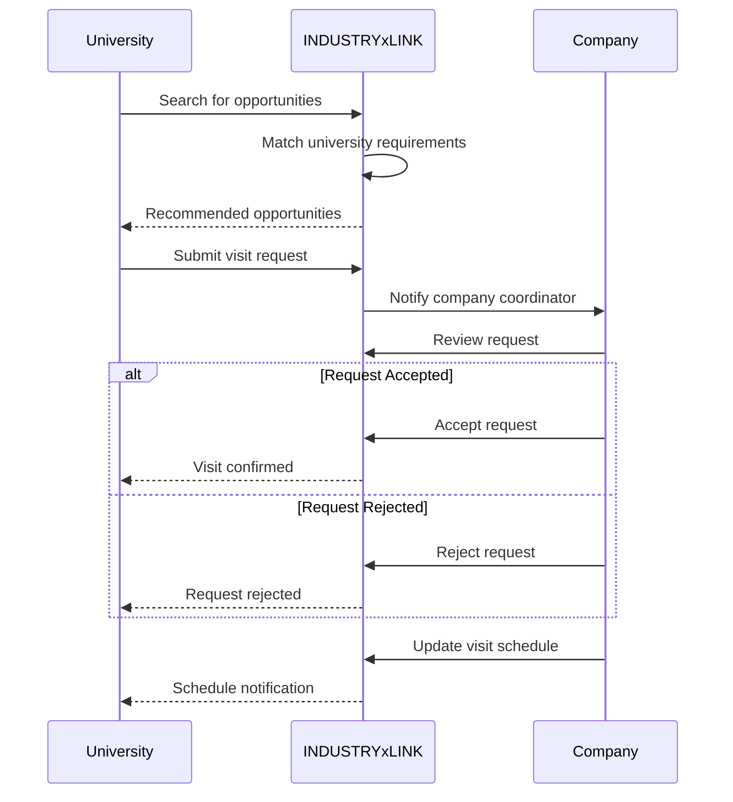
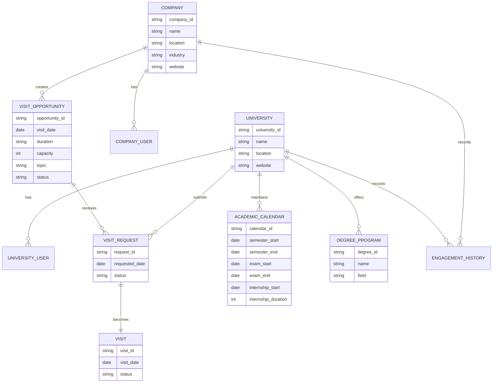

# INDUSTRYxLINK – Industry–Academia Engagement Platform

> A centralised platform connecting universities and companies to discover, coordinate, manage, and analyse industry visits and academic–industry engagement opportunities.

## 📌 Overview

**INDUSTRYxLINK** is a platform designed to improve the way universities and companies coordinate industry visits.

Currently, arranging an industry visit often involves emails, phone calls, spreadsheets, separate registration forms, and manual communication between university coordinators and company representatives. This can make it difficult to discover suitable companies, identify available visit opportunities, manage student capacity, coordinate dates, and respond quickly when a visit is postponed or cancelled.

INDUSTRYxLINK brings these activities into a single platform.

The system connects **students, lecturers, university coordinators, and company engagement representatives**, allowing them to discover suitable opportunities, manage visit requirements, receive notifications, and analyse previous industry engagement.

---

## 🎯 Problem

University industry visits provide students with valuable exposure to real-world software engineering, technology, business, and professional environments.

However, the current process has several challenges:

* Universities have difficulty finding the correct industry engagement contacts.
* Company representatives are difficult to discover and contact.
* Available visit opportunities and participant quotas are not centrally visible.
* Universities may not know which companies are currently accepting visits.
* Companies need to manually handle requests from different universities.
* University academic calendars, examination periods, and internship periods are not considered systematically.
* Visit postponements and cancellations can cause transportation and scheduling problems.
* Students may miss opportunities because available visits are not easily discoverable.
* There is limited data about previous university–company engagement.
* It is difficult to identify suitable companies based on degree programme, student count, and academic requirements.

---

# 💡 Proposed Solution

INDUSTRYxLINK provides a centralised platform where universities and companies can manage industry-visit opportunities.

The platform allows:

### 🏫 Universities

University coordinators and lecturers can:

* Create and manage their university profile.
* Maintain academic calendar information.
* Add examination periods.
* Add internship starting periods and durations.
* Specify degree programmes and specialisations.
* Maintain batch sizes and student information.
* Discover relevant companies and engagement coordinators.
* View available industry-visit opportunities.
* Submit visit requests.
* Track visit-request status.
* Receive notifications about postponements, cancellations, and rescheduling.
* View company locations and distance using Google Maps.
* View previous university–company engagement.
* Analyse their historical industry visits.

### 🏢 Companies

Company engagement coordinators can:

* Create and manage company profiles.
* Manage industry-visit opportunities.
* Specify available dates and time slots.
* Specify maximum participant capacity.
* Specify visit duration.
* Define eligible degree programmes.
* Specify what students will receive from the visit.
* Accept or reject university requests.
* Reschedule or cancel visits.
* Notify universities about schedule changes.
* View universities that previously visited the company.
* Analyse historical engagement statistics.

### 🎓 Students

Students can:

* View available industry visits through their university.
* Discover opportunities relevant to their degree.
* Receive visit-related notifications.
* View company information and location.
* View upcoming and previous visits.

---

# 🔗 Core Concept

INDUSTRYxLINK uses a **recommendation-based discovery system**, inspired by platforms such as LinkedIn.

Instead of requiring university coordinators to manually search for companies, the system can recommend relevant companies and opportunities based on factors such as:

* Degree programme
* Academic field
* Number of students
* Academic calendar
* Internship period
* Company visit capacity
* Visit topics
* Previous engagement
* Location
* Available dates

### Example

A university has:

> BSc (Hons) in Software Engineering
> 45 students
> Internship begins in July
> Academic semester ends in June

INDUSTRYxLINK can identify companies offering:

> Software Engineering / QA / DevOps / Cloud / AI related sessions
> Capacity: 40–50 students
> Available: June
> Suitable for Software Engineering students

The platform can then rank these opportunities according to their suitability.

---

# 🚀 Key Features

## 1. Industry Opportunity Discovery

Universities can discover companies and available industry-visit opportunities based on their requirements.

## 2. Company Engagement Coordinator Discovery

University coordinators can identify the relevant company representative responsible for university engagement instead of searching manually through different channels.

## 3. Smart Recommendation System

A recommendation mechanism suggests suitable companies and visit opportunities based on university and company requirements.

## 4. Visit Quota Management

Companies can define:

* Maximum participants
* Available visit slots
* Number of visits per period
* Eligible degree programmes

Universities can see available capacity before submitting a request.

## 5. Academic Calendar Integration

Universities can maintain:

* Semester dates
* Examination periods
* Internship periods
* Academic holidays
* Batch information

This information can be used when identifying suitable visit dates.

## 6. Visit Request Management

A complete workflow for:

```text
University
    ↓
Discover Opportunity
    ↓
Submit Request
    ↓
Company Review
    ↓
Accepted / Rejected
    ↓
Visit Scheduled
    ↓
Visit Completed
```

## 7. Postponement & Cancellation Notifications

If a company postpones or cancels a visit, the university coordinator can receive an immediate notification.

This allows universities to:

* Inform students
* Cancel transportation
* Update schedules
* Reschedule the visit
* Reduce unnecessary costs

## 8. Location & Distance

Google Maps integration can display:

* Company location
* University location
* Distance
* Estimated travel information

## 9. Engagement Analytics

The system can provide analytics such as:

### University

* Number of industry visits per year
* Companies visited
* Number of completed visits
* Upcoming visits
* Most frequently visited companies

### Company

* Number of universities hosted
* Number of visits conducted
* Universities previously hosted
* Number of students engaged
* Engagement trends

## 10. Engagement History

Universities and companies can view previous engagement history.

Example:

```text
University of XYZ

Industry Visits:
2024 → 3
2025 → 5
2026 → 4

Companies:
• Company A
• Company B
• Company C
• Company D
```

---

# 🧑‍💻 User Roles

| Role                   | Responsibilities                             |
| ---------------------- | -------------------------------------------- |
| Student                | Discover and participate in visits           |
| Lecturer               | Discover opportunities and coordinate visits |
| University Coordinator | Manage university visits and engagement      |
| Company Coordinator    | Manage visit opportunities and requests      |
| System Administrator   | Manage platform and users                    |

---

# 🏗️ System Architecture



---

# 🔄 Visit Management Workflow



---

# 🧠 Recommendation System

The recommendation engine is one of the core components of INDUSTRYxLINK.

A suitability score can be calculated using multiple factors.

For example:

```text
Suitability Score =
    Degree Match
    + Visit Topic Match
    + Capacity Match
    + Date Compatibility
    + Internship Period Compatibility
    + Location
    + Previous Engagement
```

The system can rank companies according to the calculated score.

### Example

```text
University Requirement
        │
        ├── Degree: Software Engineering
        ├── Students: 45
        ├── Preferred Month: June
        └── Topics: Software Engineering, Cloud, AI
                │
                ▼
       Recommendation Engine
                │
        ┌───────┼────────┐
        ▼       ▼        ▼
     Company A Company B Company C
       95%       87%       72%
```

The recommendation algorithm can initially use a rule-based scoring system and later be extended with machine-learning techniques based on historical engagement data.

---

# 🛠️ Technology Stack

## Frontend

* React.js
* TypeScript
* Tailwind CSS
* Vite
* Axios
* React Router
* Recharts

## Backend

* Node.js
* Express.js
* TypeScript
* REST API
* Mongoose

## Database

* MongoDB

## Authentication

* JWT
* Role-Based Access Control (RBAC)
* bcrypt

## External Services

* Google Maps API
* Google Maps Distance Matrix / Routes API
* Email Notification Service

## DevOps & Development

* Git
* GitHub
* GitHub Actions
* Docker
* Docker Compose

---

# 📁 Project Structure

```text
INDUSTRYxLINK/
│
├── frontend/
│   ├── src/
│   │   ├── components/
│   │   ├── pages/
│   │   ├── layouts/
│   │   ├── services/
│   │   ├── hooks/
│   │   ├── utils/
│   │   └── types/
│   │
│   ├── public/
│   ├── package.json
│   └── vite.config.ts
│
├── backend/
│   ├── src/
│   │   ├── controllers/
│   │   ├── services/
│   │   ├── routes/
│   │   ├── models/
│   │   ├── middleware/
│   │   ├── validators/
│   │   ├── utils/
│   │   ├── config/
│   │   └── types/
│   │
│   ├── tests/
│   └── package.json
│
├── docs/
│   ├── architecture/
│   ├── api/
│   ├── database/
│   └── requirements/
│
├── docker-compose.yml
├── .gitignore
└── README.md
```

---

# 🗄️ High-Level Database Model



---

# 📊 Analytics Dashboard

INDUSTRYxLINK can provide dashboards for both universities and companies.

### University Dashboard

```text
Total Visits          12
Completed Visits       9
Upcoming Visits        2
Cancelled Visits       1

Companies Engaged     8
Students Participated 430
```

### Company Dashboard

```text
Universities Hosted   15
Total Visits          28
Students Reached      1,250

Top Degree:
Software Engineering

Most Active Period:
June – August
```

These analytics can help organisations understand their industry–academia engagement patterns and improve future planning.

---

# 🔐 Security

INDUSTRYxLINK will implement:

* JWT-based authentication
* Role-based access control
* Password encryption
* API authorization
* Input validation
* Secure API communication
* Protection against unauthorized access
* Audit logging for important actions

---

# 🔮 Future Enhancements

The platform can later be extended beyond industry visits.

### Potential future features

* Internship opportunity recommendations
* Industry project collaboration
* Guest lecture management
* Company-sponsored university events
* Research collaboration
* Industrial training opportunities
* Student feedback after visits
* Automated recommendation using machine learning
* AI-assisted company–university matching
* Calendar integrations
* Automated email and WhatsApp notifications
* Industry engagement scoring
* National-level university–industry engagement analytics

This allows INDUSTRYxLINK to evolve from an **industry visit management system** into a broader **university–industry collaboration platform**.

---

# 🎯 Project Objectives

1. Centralise university–industry visit coordination.
2. Reduce manual communication and administrative work.
3. Improve discovery of suitable industry opportunities.
4. Help companies efficiently manage university engagement.
5. Reduce the impact of visit postponements and cancellations.
6. Improve planning using academic calendar information.
7. Provide data-driven insights into industry engagement.
8. Increase access to industry exposure for university students.

---

# 🌐 Target Users

* Universities
* Faculties
* Departments
* Lecturers
* Student Coordinators
* University Career/Industry Engagement Units
* Company HR Teams
* Company University Engagement Teams
* Company Technical Teams
* Undergraduate Students

---

# 📌 Project Vision

> **To build a structured digital bridge between universities and the technology industry, making industry engagement easier to discover, coordinate, manage, and measure.**

---

# 🤝 Contributing

Contributions are welcome.

1. Fork the repository.
2. Create a feature branch.
3. Commit your changes.
4. Push the branch.
5. Create a Pull Request.

```bash
git clone https://github.com/your-username/INDUSTRYxLINK.git
cd INDUSTRYxLINK
```

---

# 📄 License

This project is developed for educational and research purposes.

---

## 👨‍💻 Development Team

**INDUSTRYxLINK**

Industry–Academia Engagement Platform

Developed as a software engineering project focused on improving university–industry collaboration.
